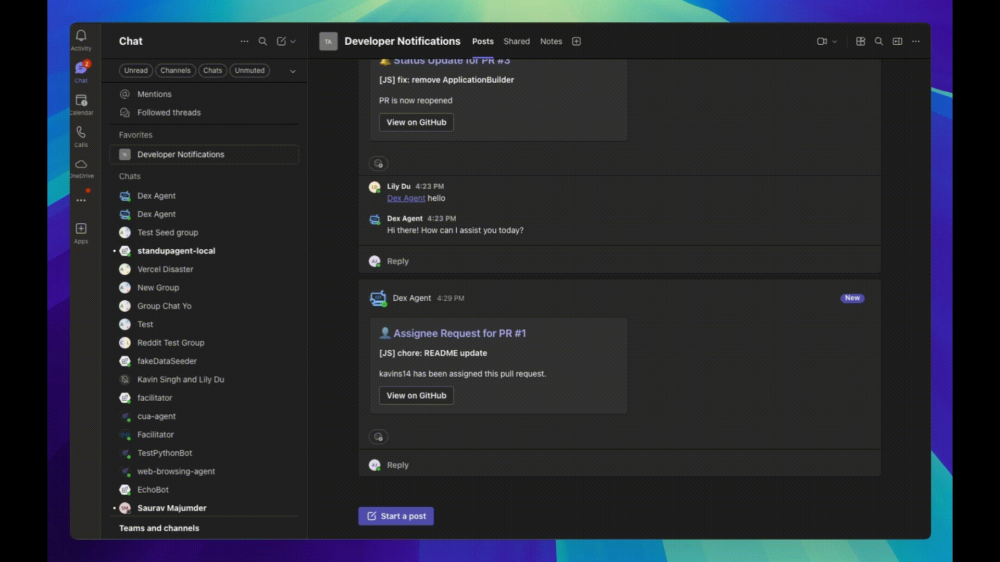
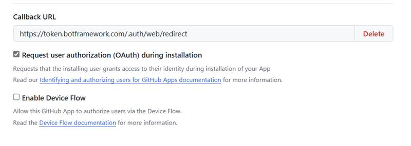
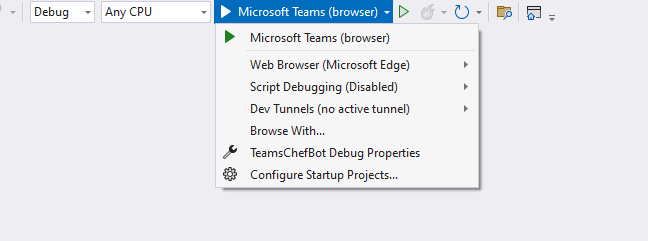
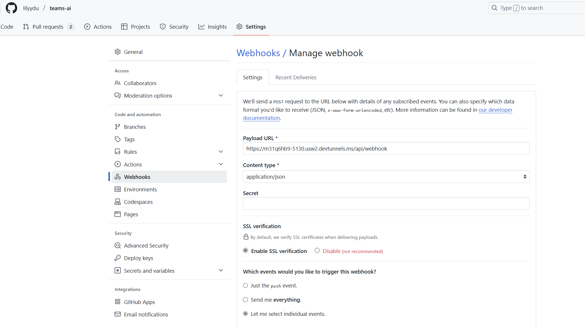

<!--
---
id: dex-agent
title: "Developer Experience Agent"
description: "A customizable agent that enhances developer experience and team productivity."
longDescription: |
  This sample showcases how an agent can enhance the Developer Experience (DEX) on Microsoft Teams using Semantic Kernel, Azure Open AI, and GitHub Apps. 

featuresList:
  - "📄 Displays a list of your repository's pull requests"
  - "🔍 Filter PRs based on labels, assignees, and/or authors"
  - "🔔 Be notified in group chats and channels when there is a new assignee on a PR"
  - "🔔 Be notified in group chats and channels when there is a status update on a PR"
tags:
  - "semantic-kernel"
  - "github"
  - "azure-openai"
githubUrl: "https://github.com/microsoft/teams-agent-accelerator-samples/blob/main/dotnet/dex-agent"
imageUrl: ""
author: "Microsoft"
language: "C#"
demoUrlGif: "https://github.com/microsoft/teams-agent-accelerator-samples/raw/main/dotnet/dex-agent/assets/listPRs.gif"
demoYoutubeVideoId: ""
---
-->

# DEX Agent for Microsoft Teams

This sample showcases how an agent can enhance the Developer Experience (DEX) on Microsoft Teams. 
Built using Semantic Kernel, Azure Open AI, and [GitHub Apps](https://docs.github.com/en/apps), you can easily customize and deploy a solution for your developers.
The agent is designed to reduce time-consuming tasks, enhance efficiency, and elevate quality and productivity across the board.

## Key Features
- 📄 **List Pull Requests**: Displays a list of your repository's pull requests
- 🔍 **Filter Pull Requests**: Filter PRs based on labels, assignees, and/or authors
- 🔔 **Proactive Alerts on PR Assignments**: Be notified in group chats and channels when there is a new assignee on a PR
- 🔔 **Proactive Alerts on PR Status Changes**: Be notified in group chats and channels when there is a status update on a PR

## Examples

### List the pull requests


### Filter the pull requests


### Proactive Notifications on Assignments


### Proactive Notifications on Status Updates


## Prerequisites

- [.NET 8.0 SDK](https://dotnet.microsoft.com/en-us/download/dotnet/8.0)
- [Teams Toolkit Extension](https://learn.microsoft.com/en-us/microsoftteams/platform/toolkit/toolkit-v4/install-teams-toolkit-vs?pivots=visual-studio-v17-7)
- [Register](https://docs.github.com/en/apps/creating-github-apps/registering-a-github-app/registering-a-github-app) your agent as a GitHub app.

    - Mark down the `Client ID` and `Client Secret`. Make sure your `Callback URL` matches the below.

    (e.g., `https://token.botframework.com/.auth/web/redirect`)

    

## Running the Sample

1. Open the solution in Visual Studio.
2. Fill in your keys for Azure and GitHub in `appsettings.Development.json`.

    ```json
      "Azure": {
        "OpenAIApiKey": "",
        "OpenAIEndpoint": "",
        "OpenAIDeploymentName": "gpt-4o",
        "OpenAIModelId": "gpt-4o"
      },
      "GITHUB_OWNER": "",
      "GITHUB_REPOSITORY": "",
      "GITHUB_CLIENT_ID": "",
      "GITHUB_CLIENT_SECRET": ""
    ```
3. Complete the updates in `.env.local`
4. In the debug dropdown menu, select `Dev Tunnels > Create A Tunnel` (Tunnel type: `Persistent` & Access: `Public`) or select an existing public dev tunnel.

5. Right-click your project and select `Teams Toolkit > Prepare Teams App Dependencies`
6. If prompted, sign in with a Microsoft 365 account for the Teams organization you want to install the app to.

> If you do not have permission to upload custom apps (sideloading), Teams Toolkit will recommend creating and using a Microsoft 365 Developer Program account - a free program to get your own dev environment sandbox that includes Teams.

7. Press F5, or select the `Debug > Start Debugging` menu in Visual Studio.

## Configure Webhooks
In order for GitHub to send a notification to your agent, you must specify a webhook on your repository and connect it to your local devtunnel.

More information is available [here](https://docs.github.com/en/apps/creating-github-apps/registering-a-github-app/using-webhooks-with-github-apps).

1. Navigate to your repository settings, click `Webhooks` on the side panel.  
2. Click `Add webhook` on the top right.
3. Set your `payload URL` to your `BOT_ENDPOINT` in the `env/.env.local` file, followed by `/api/webhook`.
(e.g., `https://f3z8srb6-3978.usw2.devtunnels.ms/api/webhook`)
4. Click `Let me select individual events`, and check `Pull Requests`.



## Swap the Repository Tool

Although this agent is currently configured to use GitHub, you can easily swap for another repository tool.

Note the restrictions:
- Only one repository tool can be configured at a time, due to the Azure Bicep file deployments.
- Different repository tools require different API keys, hence these will need to be added manually.
- Authentication is restricted to `Oauth Azure Bot Service Providers`.

There are a few components. You may define your own structs similar to those in `GitHubModels`
### 1) Authentication 
1. Update `teamsapp.yml` and `teamsapp.local.yml`, with your keys in the `file/createOrUpdateJsonFile` step.
2. In `.env.local`, update `OAUTH_CONNECTION_NAME` to your respective tool, and add in your keys.
3. Similiarly, update your keys in the `appsettings.Development.json` file.
4. Update the files inside the `/infra` folder - this controls the local deployments and the Oauth Service Provider registration.
Replace the GitHub values with your new tool.

### 2) Activity Handlers
All handlers are registered in `DexBot.cs`. These can be easily updated and customized. 

`ListPRs` is auto-invoked by the kernel via `app.OnActivity(ActivityTypes.Message...)`

`FilterPRs` is manually invoked via `app.AdaptiveCards.OnActionSubmit(...)`

### 3) Webhooks
All webhook URLs must start with `api/webhook`.

Create a service class for your tool.
Your service class must extend `IRepositoryService` (e.g., `GitHubService`). 

The `BotController` will route incoming webhook POST events to this class via `HandleWebhook`.

Instantiate your service inside `Program.cs` in the `IRepositoryService` transient registration.

```csharp
GitHubPlugin plugin = new(client, config);
return new GitHubService(storage, adapter, plugin);
```

### 4) Plugins
All plugins must follow the Semantic Kernel requirements and extend `IRepositoryPlugin` (e.g., `GitHubPlugin`). 

Note that `ListPRs` is a required plugin to implement. 

You may also implement `FilterPRs` depending on what filters
your tool provides.

Instantiate your plugin inside `Program.cs` in the `IRepositoryService` transient registration (see above).
Then, update the plugin provided during the Semantic Kernel registration.

```csharp
 GitHubPlugin plugin = (GitHubPlugin)repoService.RepositoryPlugin;
 kernelBuilder.Plugins.AddFromObject(plugin, "GitHubPlugin");
```

### 5) Conversation Management

Please use the methods inside `KernelOrchestrator` to manage conversation history. 

Update the string comparison of `GitHubPlugin-ListPRs` in `GetChatMessageContentAsyncForOneToOneScenarios`.

Be sure to also update the prompt
in `KernelOrchestrator.InitiateChat`.