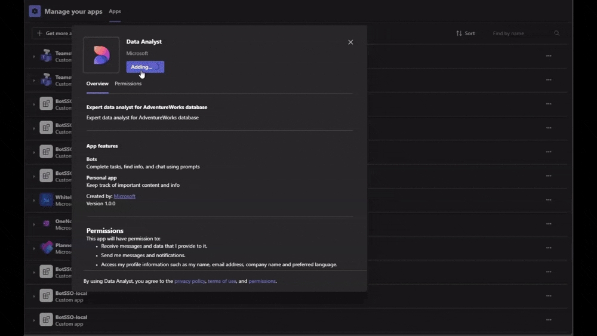
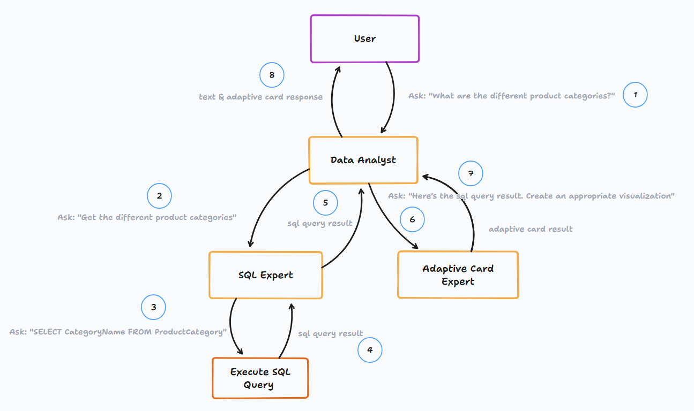

# Data Analyst Agent

An AI-powered data analyst agent that helps users explore and visualize data through natural language conversations and Adaptive Cards charts.

## Overview
The Data Analyst Agent combines SQL querying capabilities with data visualization to help users:
- Query databases using natural language
- Generate visualizations from query results
- Analyze data patterns and trends
- Create interactive Adaptive Cards for data presentation



## Getting Started

### Prerequisites
- [Node.js](https://nodejs.org/) version 18.x or higher
- [npm](https://www.npmjs.com/) (comes with Node.js)
- [Teams Toolkit Extension](https://marketplace.visualstudio.com/items?itemName=TeamsDevApp.ms-teams-vscode-extension) for Visual Studio Code
- A Microsoft Teams account with the ability to upload custom apps
- OpenAI API Key or Azure OpenAI resource.

### Installation
1. Clone this repository:
   ```bash
   git clone https://github.com/microsoft/teams-agent-accelerator-samples
   cd js/data-analyst-agent
   ```

2. Install dependencies:
   ```bash
   npm install
   ```

### Environment Setup
1. Copy the sample environment file:
   ```bash
   cp sample.env .env
   ```

2. Update the `.env` file with your configuration:
   - `BOT_ID`: Your Microsoft Teams bot ID (will be automatically generated if using Teams Toolkit)
   - `BOT_PASSWORD`: Your bot's password (will be automatically generated if using Teams Toolkit)
   - Azure OpenAI or OpenAI configurations. See `sample.env` for more details.

### Running the Bot

#### Option 1: Using Teams Toolkit (Recommended)
1. Open the project in Visual Studio Code
2. Press F5 to start the debug session
3. Teams Toolkit will handle:
   - Starting the local bot server
   - Tunneling for external access
   - Opening Teams with your bot loaded

#### Option 2: Manual Start
1. Start the development server:
   ```bash
   npm run dev
   ```
2. The bot will be available on `http://localhost:3978`
3. Use ngrok or similar to expose your local server
4. Update your bot endpoint in Azure Bot Service

## Dataset
This agent uses the AdventureWorks sample database, a Microsoft-provided dataset that simulates a bicycle manufacturer's data. The database includes:

### Core Business Areas
- **Sales**: Orders, customers, territories
- **Production**: Products, inventory, work orders
- **Purchasing**: Vendors, purchase orders
- **HR**: Employees, departments
- **Person**: Contact information

### Sample Questions
You can ask the agent questions like:
- "Show me the top-selling products this year"
- "What's the sales trend by territory?"

See the [AdventureWorks README](src/data/README.md) for more details.


<!-- TODO: Add detailed usage instructions covering:
## Usage
- Basic query examples and syntax
- Data visualization capabilities and examples
- Common usage patterns and workflows
- Best practices and recommendations -->

## Architecture


**Core Components**
  - Data Analyst Agent: Main orchestrator that handles user requests
  - SQL Expert Agent: Handles database querying
  - AC Expert Agent: Creates data visualizations using Adaptive Cards
  - Base Agent: Handles LLM calls and orchestration. Other agents are built on top of this.


<!-- TODO: ## Evaluation System
- Judges Overview
- Evaluation Criteria
- Scoring System -->